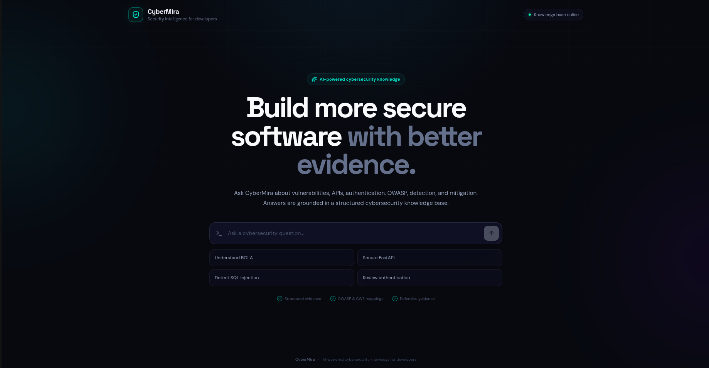

# CyberMira

> AI-powered cybersecurity knowledge for developers.

CyberMira is an AI-powered cybersecurity assistant that uses structured,
curated security knowledge through Sanity and Sanity Context.

## Architecture

- React / Vite — frontend
- FastAPI — AI/backend API
- Sanity — structured cybersecurity knowledge
- Sanity Context — knowledge access for the AI agent
- Docker — local development and deployment

## Project Structure

```text
cybermira/
├── apps/
│   ├── api/
│   └── web/
├── sanity/
│   └── studio/
├── data/
│   └── seed/
├── docs/
│   └── architecture.md
├── docker-compose.yml
├── README.md
└── .gitignore


